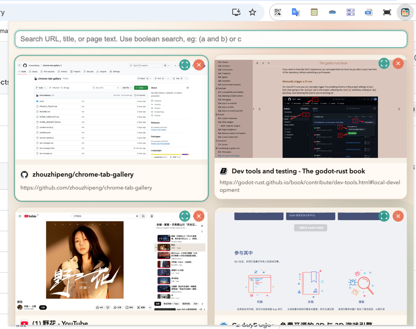
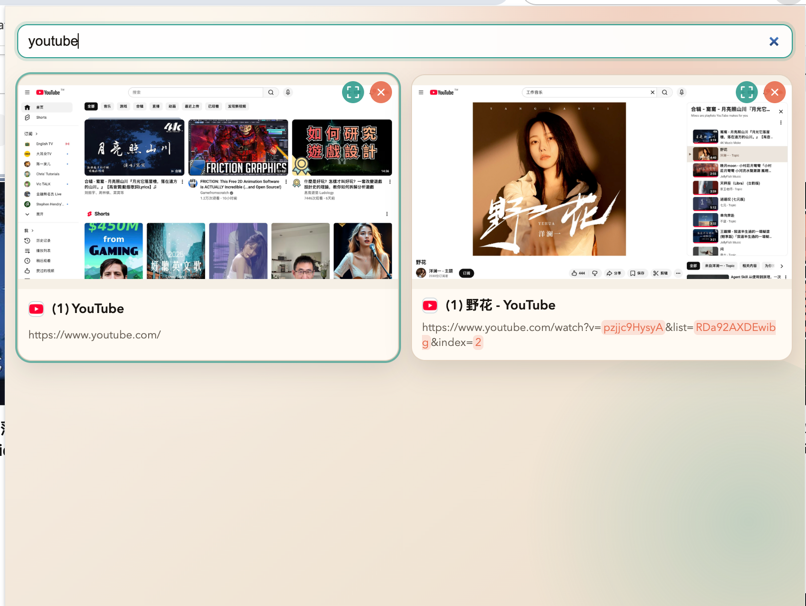
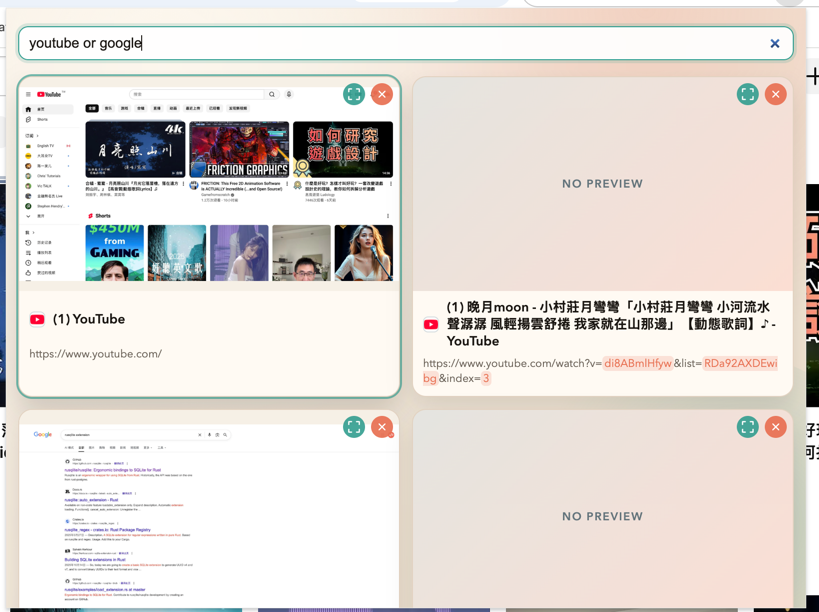
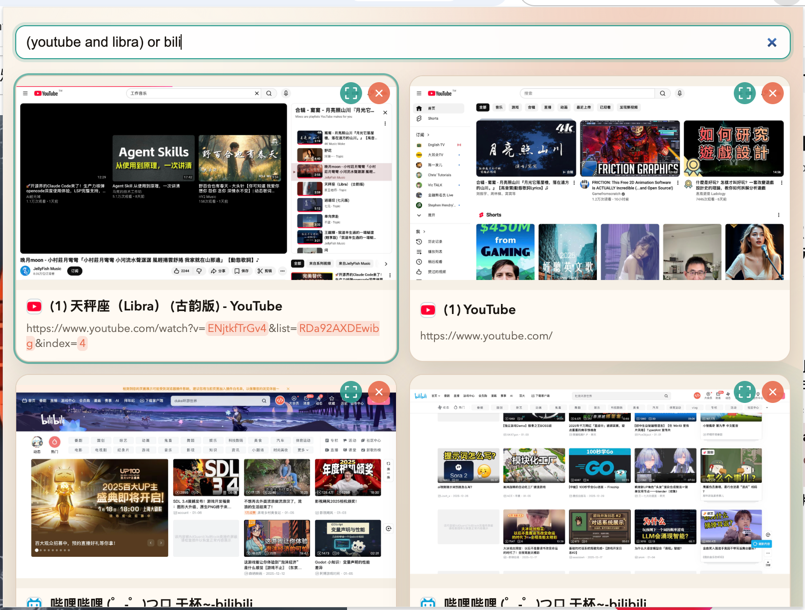

# Tab Gallery
A visual tab manager that shows all of your open tabs as live previews inside a compact Chrome popup (like the Google Translate extension panel). It keeps previews fresh, lets you jump to any tab instantly, and supports fast search across URL, title, and page body text.

## Previews

### popup panel

### normal search
> match all tabs in title / url / page text

### boolean search
> and

> or

> combo

## Features

- Popup UI: opens from the toolbar icon; no new windows or tabs.
- Visual previews: 2K (2048×1536) thumbnails cached per tab.
- Smart ordering: most recently activated tabs appear first.
- Fast search: prioritizes URL, then title, then page body text.
- Full URL display: decoded URLs with query values highlighted.
- Quick actions: click a card to focus the tab; use the x button to close it.

## How It Works

1. The extension listens for tab activation and page load events.
2. When needed, it captures the visible tab and stores a high‑resolution preview.
3. A content script reads plain text from the page body (no HTML tags) and caches it for search.
4. The popup UI renders a preview grid and updates live.

## Usage

1. Open `chrome://extensions` and enable **Developer mode**.
2. Click **Load unpacked** and select the `extension/` folder.
3. Pin the extension (optional) and click the **Tab Gallery** icon.
4. Use the search box to filter by URL, title, or body content.
5. Click a card to jump to that tab (the popup closes automatically).

## Notes & Limitations

- Chrome blocks content scripts on some internal pages (`chrome://`, extension pages), so those tabs will not have body text.
- Body text is cached after a tab is seen; inactive or discarded tabs may need to be activated once.
- Previews are limited to recent tabs for storage safety.

## Project Structure

- `manifest.json` — Chrome MV3 manifest and permissions.
- `service-worker.js` — background worker for preview capture and metadata.
- `content-script.js` — page body text collector.
- `tab-manager.html` — popup UI markup.
- `tab-manager.css` — popup UI styling.
- `tab-manager.js` — popup UI logic (rendering, search, focus/close).
- `icons/` — extension icons.

## Permissions

- `tabs` — read tab metadata and capture previews.
- `storage` — store cached previews and search text.
- `unlimitedStorage` — allow high‑resolution preview caching without quota issues.
- `<all_urls>` — access pages for capture and body text.

## Development

No build step required. Edit files in `extension/` and click **Reload** in `chrome://extensions`.
